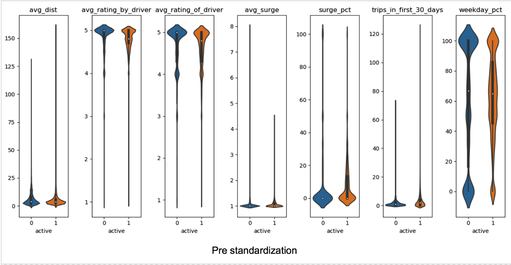
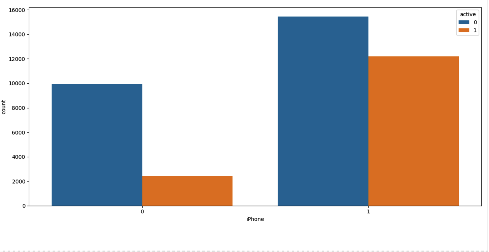
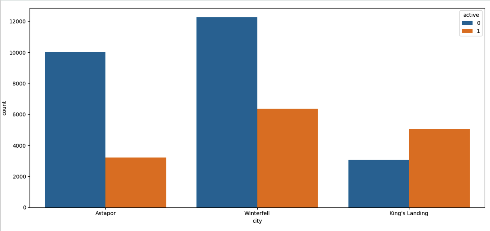
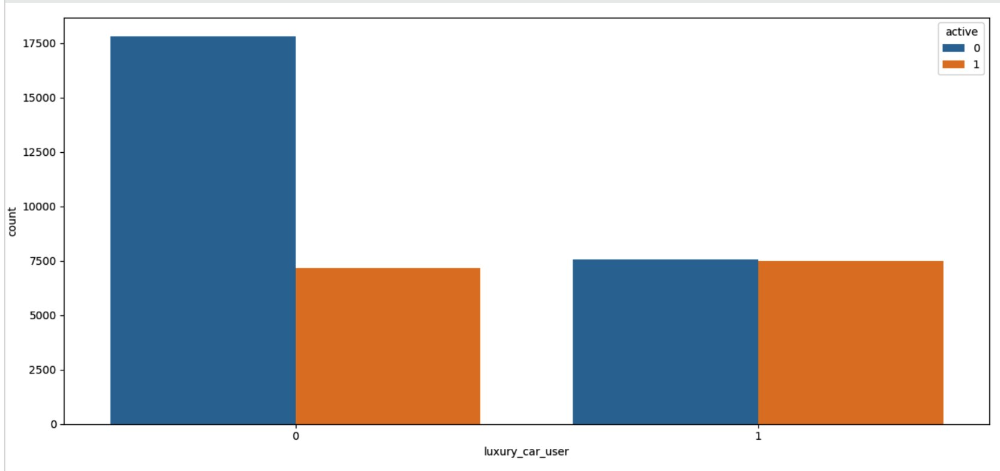
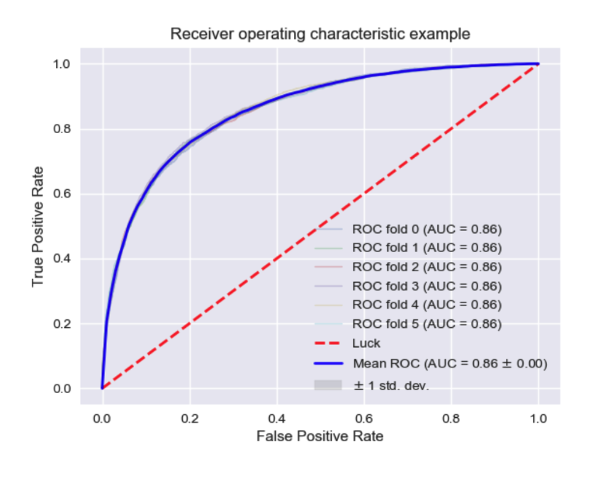
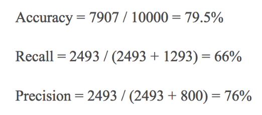

# Predicting Churn For a Ride Sharing Company  
*See 'Case of the Churns' pdf to see an overview of our work*  

### Introduction
For this case study we analyzed a dataset of users from 2014 to predict if, and why, a user would churn. We considered a user active if they had used the service in the past 30 days and looked at many features including:  
  
  - Average trip distance *most important feature*
  - Average rating by driver
  - Average rating of driver
  - Average surge
  - Surge percentage
  - Number of trips in first 30 days
  - Luxury car users
  - Weekday percentage 
  
## EDA
Before modeling, we did some general EDA to better understand the data we were working with. Below are some plots we found the most interesting and helpful. **Note: this is pre-standardization**  
  
  
  
  
  
  
  
  
  
## Modeling
After testing a few different models, we decided a gradient boosted tree method, XGBoost Classifier, would be best for our purposes as it gave us the highest F1 score. Below is an ROC curve followed by our accuracy, recall, and precision. 
  
  
  

## Recommendations
We offered many recommendations to the company.  
- The first and most important one was how they could increase the quality of their data by suggesting new metrics to track.  
- We also suggested the use of offering some type of incentive to people we believe are on the verge of churning.